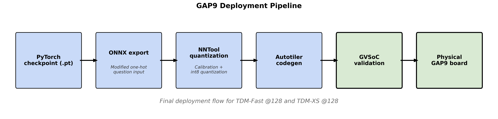
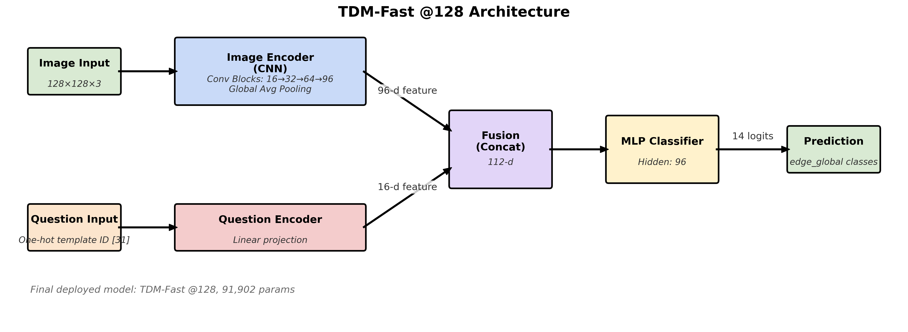
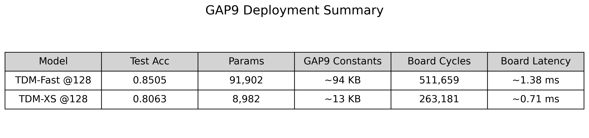
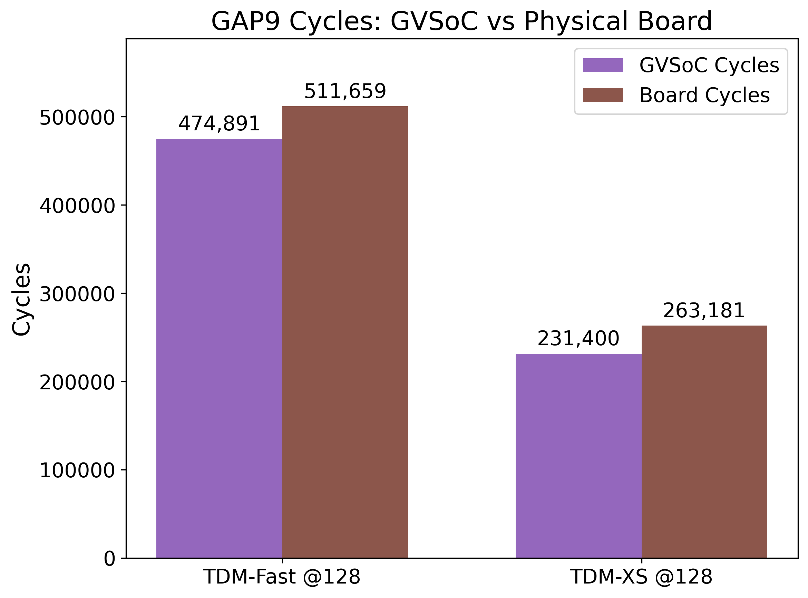

# TinyDisasterVQA: Disaster-Scene VQA on GAP9

**TinyDisasterVQA** is a lightweight visual question answering pipeline designed for disaster-scene understanding, deployed on the GreenWaves GAP9 microcontroller. It uses the FloodNet-VQA dataset of UAV imagery, reformulates the task into a compact 14-class classification problem, trains teacher and student models, exports them to ONNX, quantizes with NNTool, generates GAP9 kernels via Autotiler, and validates execution in GVSoC and on the physical GAP9 board. 
**TDM-Fast @128 reaches 85.05% test accuracy and runs on physical GAP9 in ~1.38 ms at 370 MHz.**

---

## Key Results

| Model | Test Accuracy | Params | GAP9 Constants | Board Cycles | Board Latency | Role |
| :--- | :---: | :---: | :---: | :---: | :---: | :--- |
| **TDM-Fast @128 + CE** | 85.05% | 91,902 | ~94 KB | 511,659 | ~1.38 ms | Primary deployed model |
| **TDM-XS @128 + CE** | 80.63% | 8,982 | ~13 KB | 263,181 | ~0.71 ms | Ultra-tiny reference baseline |

---

## Visual Overview

### GAP9 Deployment Pipeline


### TDM-Fast @128 Architecture


### GAP9 Deployment Summary


### GAP9 Cycles: GVSoC vs Board


---

## Dataset and Task Formulation

*Note: The FloodNet-VQA source dataset is expected to be downloaded separately and is not included in this repository.*

- **Dataset Split Sizes:**
  - **Train:** 5,898 QA pairs
  - **Validation:** 1,806 QA pairs
  - **Test:** 1,833 QA pairs
  - **Total:** 9,537 QA pairs (across 2,188 unique images)
- **Task Reformulation:**
  - **Original formulation:** 51 distinct answer classes.
  - **Final TinyDisasterVQA formulation:** 14 `edge_global` classes.
  - Count answers are capped at a maximum of `5+`.
  - Questions are parsed into one of 31 unique question templates.
- **Inputs and Outputs:**
  - **Image Input:** $128 \times 128$ RGB
  - **Question Input:** One-hot template vector of size $[1, 31]$
  - **Output:** 14 logits

---

## Repository Structure

```text
TinyDisasterVQA/
├── scripts/                     # Python scripts for data processing, training, and GAP9 toolchains
├── src/
│   └── tinydisastervqa/         # Main package source code
├── outputs/                     # Processed CSV manifests, answer spaces, and training data
├── checkpoints/                 # Saved PyTorch checkpoints
├── onnx/                        # Exported ONNX models
├── docs/
│   └── presentation_assets/     # Generated figures, plots, and architecture diagrams
├── benchmark_logs_final/        # Real-device logs for latency and cycles
├── gap9_generated_final/        # [Generated] Autotiler C code, CMake configs, and binaries
└── dataset/                     # [Ignored] Raw FloodNet-VQA dataset (images & annotations)
```

---

## Pipeline

The end-to-end pipeline is structured sequentially across the following scripts:

1. `01_explore_dataset.py` - Analyzes FloodNet dataset structures.
2. `02_build_manifest.py` - Builds a unified CSV manifest.
3. `03_build_answer_space.py` - Generates the 14-class answer space and weights.
4. `04_prepare_training_data.py` - Maps templates and generates `cap5` training CSVs.
5. `05_train_teacher.py` - Trains the heavy teacher models.
6. `06_train_student.py` - Trains the tiny TDM student variants.
7. `07_export_student.py` - Exports PyTorch weights to a static ONNX graph.
8. `08_generate_gap9_artifacts.py` - Runs NNTool quantization and Autotiler.
9. `09_make_gap9_demo_input.py` - Generates quantized binary inputs for the board.
10. `10_gap9_random_demo.py` - Runs sample inferences.
11. `11_generate_presentation_assets.py` - Generates the figures in `docs/presentation_assets/`.

---

## Reproducing the Core Pipeline

Below are example commands to run the core pipeline stages.
*Note: GAP9 and NNTool commands should be run inside the GAP9 Docker/SDK environment.*

**Exploring and Preparing Data (cap5):**
```bash
python scripts/01_explore_dataset.py
python scripts/04_prepare_training_data.py
```

**Exporting ONNX Models:**
```bash
python scripts/07_export_student.py --checkpoint checkpoints/tdm_fast_128.pt
```

**Generating GAP9 Artifacts (NNTool + Autotiler):**
```bash
python scripts/08_generate_gap9_artifacts.py --onnx onnx/tdm_fast_128.onnx
```

**Generating Demo Inputs:**
```bash
python scripts/09_make_gap9_demo_input.py --row-index 0
```

**Running on GVSoC or Physical Board:**
Navigate to the generated folder to compile and run:
```bash
cd gap9_generated_final/tdm_fast_128
cmake -B build -G "Unix Makefiles"
cmake --build build --target menuconfig
# In menuconfig, select Platform -> GVSoC or Board
cmake --build build --target run
```

---

## Deployment Details

- **ONNX Export Interface:** The original PyTorch models used an internal embedding layer (`question_template_id -> OneHot -> Linear`). During export, this created an ONNX `OneHot` operator that NNTool could not import. The fix was to move the one-hot encoding *outside* the model so the ONNX/GAP9 graph directly accepts a `[1, 31]` float32 vector.
- **NNTool Calibration & Quantization:** NNTool imports the ONNX graph, calibrates intermediate activations, and applies 8-bit integer quantization (SQ8) to optimize for the GAP9 NE16 accelerator.
- **Autotiler Code Generation:** Generates the C-level graph and L3-to-L1 memory tiling logic.
- **Input Binaries:**
  - `Input_1.bin`: `uint8` quantized image `[1, 3, 128, 128]` (49,152 bytes)
  - `Input_2.bin`: `float32` question one-hot vector `[1, 31]` (124 bytes)

---

## Results

### Teacher Ablation Summary
*T5 is the best overall teacher, while T6 is the best teacher for count-specific accuracy.*

| Teacher Configuration | Test Acc | Macro Acc | Count Acc |
| :--- | :---: | :---: | :---: |
| T1: cap10 + LSTM + CE | 85.71% | 51.44% | 50.91% |
| T2: cap5 + LSTM + CE | 86.91% | 65.93% | 57.44% |
| T3: cap10 + template + CE | 86.74% | 53.02% | 52.22% |
| T4: cap5 + template + CE | 88.43% | 68.61% | 62.66% |
| **T5: cap5 + template + WCE** | **88.87%** | **68.93%** | **63.97%** |
| **T6: cap5 + template + Aux Loss** | 88.71% | **69.13%** | **64.23%** |

### Student Ablation Summary
*TDM-Fast @128 was selected as the main deployed model. TDM-XS @128 serves as the ultra-tiny baseline.*

| Student Configuration | Params | Test Acc | Macro Acc | Count Acc |
| :--- | :---: | :---: | :---: | :---: |
| TDM-Fast @224 + CE | 91,902 | 85.22% | 60.37% | 54.31% |
| **TDM-Fast @128 + CE** | **91,902** | **85.05%** | **59.15%** | **53.00%** |
| TDM-S @224 + CE | 25,814 | 84.56% | 58.46% | 50.39% |
| TDM-S @128 + CE | 25,814 | 82.65% | 54.95% | 44.39% |
| **TDM-XS @128 + CE** | **8,982** | **80.63%** | **51.67%** | **41.51%** |

### Final GAP9 Deployment Results (GVSoC vs Physical Board)

**TDM-Fast @128:**
- **GVSoC Simulator:** 474,891 cycles | 14,770,480 ops | 31.10 ops/cycle | ~1.28 ms at 370 MHz
- **Physical GAP9 Board:** 511,659 cycles | 14,770,480 ops | 28.87 ops/cycle | ~1.38 ms at 370 MHz

**TDM-XS @128:**
- **GVSoC Simulator:** 231,400 cycles | 1,323,128 ops | 5.72 ops/cycle | ~0.63 ms at 370 MHz
- **Physical GAP9 Board:** 263,181 cycles | 1,323,128 ops | 5.03 ops/cycle | ~0.71 ms at 370 MHz

---

## Extensions / Future Work

- Extend the pipeline to general COCO-VQA-style tasks.
- Validate on RescueNet or other disaster-response datasets.
- Improve output verification by extracting and printing GAP9 argmax/logits directly in the C application.
- Explore more NE16-friendly student architectures to maximize ops/cycle.
- Investigate multi-task or multi-head model versions if supported by NNTool/Autotiler deployment constraints.

---

## Citations and Acknowledgments

- **FloodNet Dataset Reference:**
  ```bibtex
  @inproceedings{rahnemoonfar2021floodnet,
    title={Floodnet: A high resolution aerial imagery dataset for post disaster damage assessment},
    author={Rahnemoonfar, Maryam and Chowdhury, Tateona and Sarkar, Robin and Varshney, Debvrat and Yasar, Masood and Ekblad, David},
    booktitle={Proceedings of the IEEE/CVF Conference on Computer Vision and Pattern Recognition},
    pages={13587--13597},
    year={2021}
  }
  ```
- **TinyVQA Baseline Reference:**
  ```bibtex
  @inproceedings{alrashid2024tinyvqa,
    title={TinyVQA: Compact Multimodal Deep Neural Network for Visual Question Answering on Resource-Constrained Hardware},
    author={Al Rashid, Hasib and Sarkar, Argho and Gangopadhyay, Aryya and Rahnemoonfar, Maryam and Mohsenin, Tinoosh},
    booktitle={Proceedings of the tinyML Research Symposium},
    year={2024}
  }
  ```